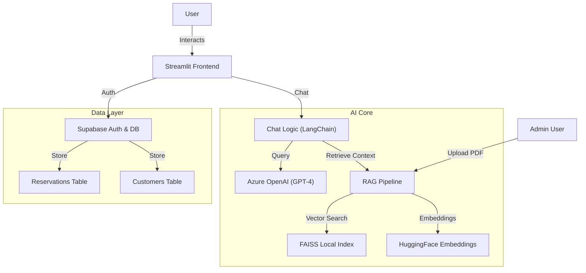

# Starwalk Dining AI 🌟

[](https://dhedeep-reddy-starwalk-dining-app-mjwj6l.streamlit.app/)

## Live Demo
**Try it here:** [https://dhedeep-reddy-starwalk-dining-app-mjwj6l.streamlit.app/](https://dhedeep-reddy-starwalk-dining-app-mjwj6l.streamlit.app/)

## Introduction
**Starwalk Dining** is a futuristic, AI-powered restaurant reservation system. It demonstrates the power of Agentic AI in handling end-to-end customer interactions, from answering queries about the menu using RAG (Retrieval Augmented Generation) to managing real-time table reservations via a database.

Designed with a premium "Noir/Gold" aesthetic, the application provides a seamless experience for both Customers (Chat & Booking) and Administrators (Menu Logic & Dashboard).

## 🚀 Features
- **AI Chatbot**: Conversational agent powered by Azure OpenAI (GPT-4) that guides users through booking.
- **RAG Knowledge Base**: Upload PDF menus or policies, and the bot instantly learns from them to answer questions (e.g., "What is the price of the steak?").
- **Smart Booking Flow**: Validates emails, phone numbers, and dates intelligently before confirming reservations.
- **Admin Dashboard**: Secure panel to view all bookings and manage the knowledge base.
- **Email Integration**: Sends confirming emails to clients upon successful booking.
- **User Profiles**: Customers can log in to view their past reservation history.

## 🏗️ Architecture
The system is built on a modern Python stack optimized for rapid prototyping and AI integration.



### Tech Stack
- **Frontend**: Streamlit
- **Database**: Supabase (PostgreSQL)
- **LLM**: Azure OpenAI (GPT-4o)
- **Embeddings**: HuggingFace (`all-MiniLM-L6-v2`)
- **Vector Store**: FAISS (Facebook AI Similarity Search)
- **PDF Processing**: `pypdf`, `reportlab`

## 🛠️ Setup & Installation

### Prerequisites
- Python 3.10+
- Supabase Account
- Azure OpenAI Credentials

### Local Run
1. **Clone the repository**:
   ```bash
   git clone https://github.com/dhedeep-reddy/starwalk-Dining.git
   cd starwalk-Dining
   ```
2. **Install Dependencies**:
   ```bash
   pip install -r requirements.txt
   ```
3. **Configure Environment**:
   Create a `.env` file in the root directory:
   ```env
   SUPABASE_URL=your_supabase_url
   SUPABASE_KEY=your_supabase_key
   AZURE_OPENAI_API_KEY=your_key
   AZURE_OPENAI_ENDPOINT=your_endpoint
   EMAIL_SENDER=your_email
   EMAIL_PASSWORD=your_app_password
   ```
4. **Run App**:
   ```bash
   streamlit run app.py
   ```

## 🧪 Testing Credentials
You can use the following credentials to test the application's Admin features and Booking history.

### Admin / Test Account
- **Email**: `dhedeepreddy23@gmail.com`
- **Password**: `HLijbto89`
- **Role**: Administrator (Can access Dashboard)

### Admin Features
1. Log in with the above credentials.
2. Navigate to **Admin** page.
3. **Knowledge Base**: Upload the sample `assets/Starwalk_Menu.pdf` and process it.
4. **Reservations**: View and manage customer bookings.

## 📂 Project Structure
- `app.py`: Main entry point.
- `chat_logic.py`: Handles conversation state and LLM calls.
- `booking_flow.py`: State machine for validatng user inputs.
- `rag_pipeline.py`: Handles PDF ingestion and Vector Search.
- `pages/`: Streamlit multipage routing (Login, Register, Chat, Profile, Admin).
